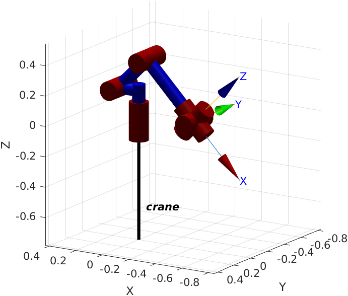
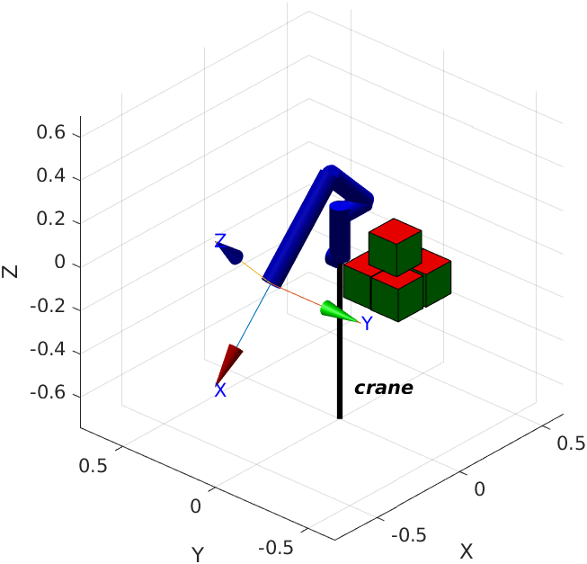
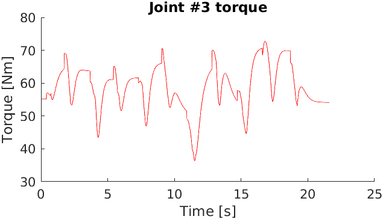
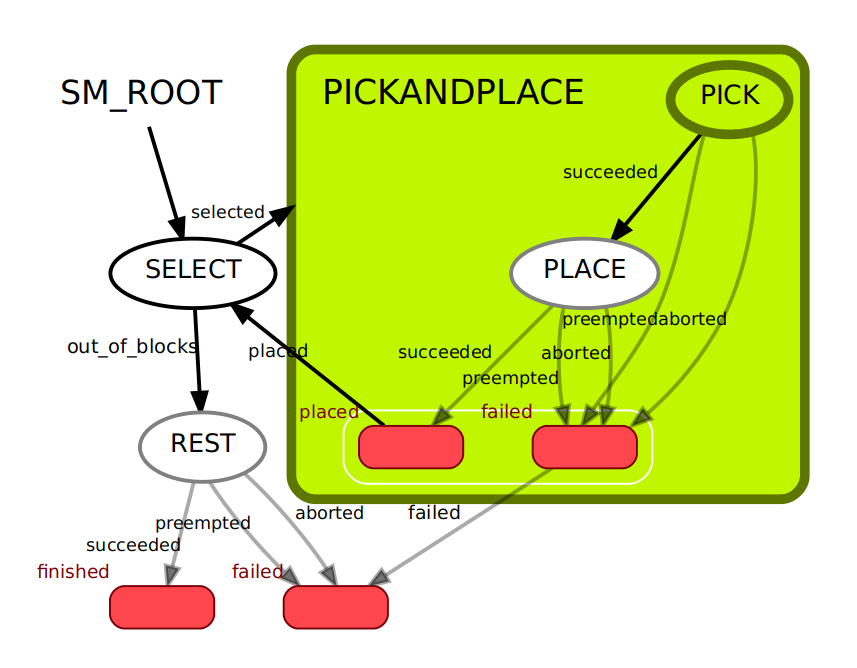

# RoboticManipulator

Simulation of a simple robotic arm to perform pick-and-place tasks.

The manipulator is created in Matlab with the Robotics Toolbox.  
A ROS state-machine, running locally or remotely, instructs the robot to move to the position of the target object; the arm reaches the desired location by means of a computed-torque controller, picks the item and eventually places it where desired with fair precision.

---

 |  
:-------------------------:|:-------------------------:
  |  

## Dependencies:

- [Robotics Toolbox](https://petercorke.com/toolboxes/robotics-toolbox/) by Peter Corke
- ROS smach

## Build

*Matlab*  
Install the Robotics Toolbox following the instructions in the official website

*ROS*  
```
cd ros/catkin_ws
catkin build
source devel/setup.bash
```

## Run
*Matlab*  
Run `main.m`

*ROS*  
```
rosrun pick_and_place_controller state_machine.py
```

Visualize the state machine with:
```
rosrun smach_viewer smach_viewer.py
```

## License

[MIT](LICENSE)
